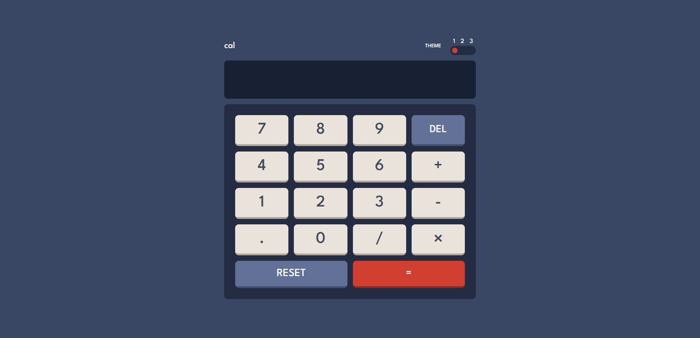

# Frontend Mentor - Calculator app solution

This is a solution to the [Calculator app challenge on Frontend Mentor](https://www.frontendmentor.io/challenges/calculator-app-9lteq5N29). Frontend Mentor challenges help you improve your coding skills by building realistic projects. 

## Table of contents

- [Overview](#overview)
  - [The challenge](#the-challenge)
  - [Screenshot](#screenshot)
  - [Links](#links)
- [My process](#my-process)
  - [Built with](#built-with)
- [Author](#author)

## Overview

### The challenge 🎯 

Users should be able to:

- See the size of the elements adjust based on their device's screen size
- Perform mathmatical operations like addition, subtraction, multiplication, and division
- Adjust the color theme based on their preference

### Screenshot

### Links

- Live Site URL: [Calculator-app](https://hadi-sanei.github.io/Calculator-app)

## My process

### Built with

- 
- 
- 
- 
- 

## Author

- Github - [Hadi Sanei](https://github.com/hadi-sanei)
- Frontend Mentor - [@hadi-sanei](https://www.frontendmentor.io/profile/hadi-sanei)

(<a href="#Calculator-app">back to top</a>)
